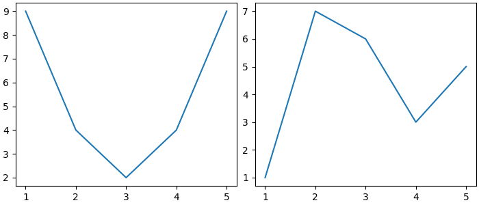

# Лабораторная работа 5.
## Построение графиков в Python
### Уроки 1-3





### Задание
Выберите одну из неразрывных функции своего варианта из лабораторной работы №2, постройте график этой функции и касательную к ней. Добавьте на график заголовок, подписи осей, легенду, сетку.

```python
import math
import matplotlib.pyplot as plt
import numpy as np

def f(x):
    return 8*x**3*math.cos(x)

def f_pr(x):
    return 24*x**2*math.cos(x)-8*x**3*math.sin(x)
def yk(t, x):
    for i in x:
        y1.append(f(t) + f_pr(t) * (i - t))
    return y1
tochka_kasaniya = 0.2
x = np.linspace(0,1,100)
y = []
for i in x:
    y.append(f(i))
x1 = [0.0, 1.0]
y1 =[]
plt.title('График')
plt.xlabel('x')
plt.ylabel('y')
plt.grid()
plt.plot(x, y)
plt.plot(x1, yk(tochka_kasaniya, x1))
plt.plot(tochka_kasaniya, f(tochka_kasaniya), "ro")

plt.show()
```
### График
